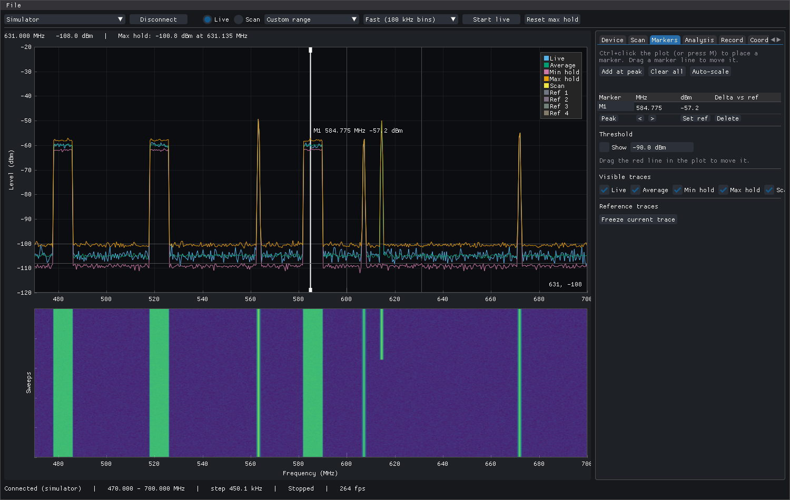
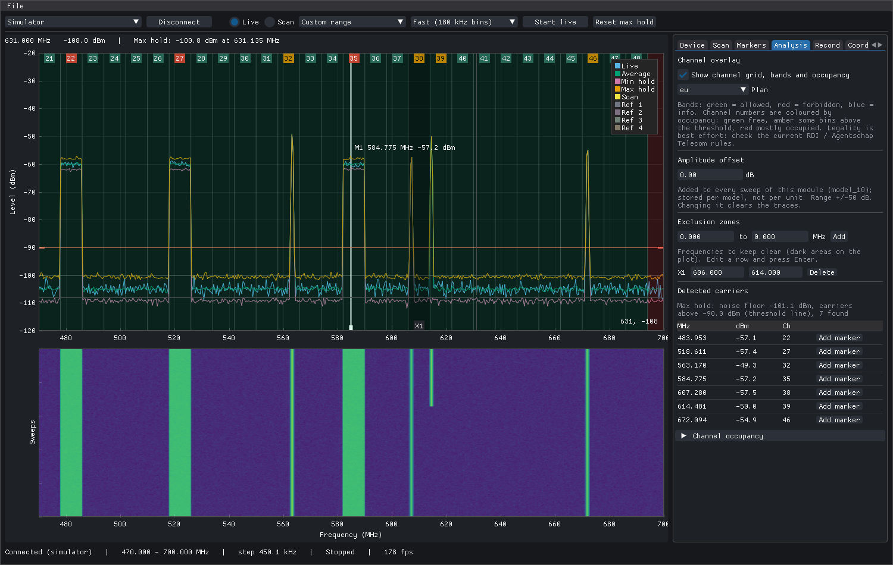
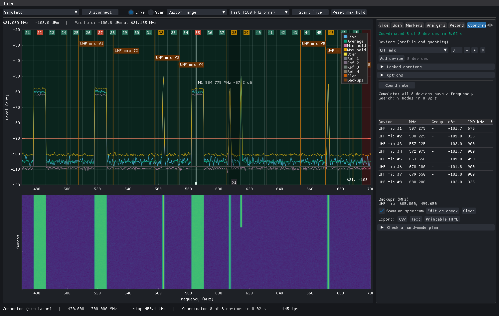

# OpenCoord

Open-source spectrum scanner for [RF Explorer](https://www.j3.rf-explorer.com/) devices and frequency
coordinator for wireless microphones and in-ear monitors (IEMs). Scan the venue, then let OpenCoord
compute an intermodulation-free set of frequencies for all your gear, including amateur and custom
devices you describe yourself.

Cross-platform (Windows, macOS, Linux), written in Python with Dear PyGui, licensed GPL-3.0-or-later.



> **Status: v0.1, pre-release.** The scanner was tested on an RF Explorer WSUB1G+ only; see
> [Supported devices](#supported-rf-explorer-models). The WWB and WSM CSV exports are built from public
> format notes and have **not** been verified against the real programs.
> The screenshots in this README use the built-in simulator, not real RF data.

## Features

**Scanner**
- Live spectrum with average, min-hold and max-hold traces, plus a waterfall that shares the frequency axis.
- Segmented wide-band scans (Fast / Normal / Fine) that stitch narrow segments into one high-resolution
  trace, for example the whole 470-960 MHz UHF range; presets for common ranges and a custom range.
- Markers (up to 8) with peak search, next peak and delta readout, a threshold line, four reference traces.
- Amplitude offset per RF Explorer model, and a switch between the main module and an expansion module.

**Analysis**
- Channel overlay with the EU/Netherlands DVB-T plan (channels 21-48): per-channel occupancy colouring and
  band annotations (allowed / forbidden / informational).
- Exclusion zones (frequencies to keep clear) and a detected-carrier list with channel numbers.

**Recording and sessions**
- Record sweeps to crash-recoverable `.ocrec` files and replay them at 1x, 4x or maximum speed.
- Long-run max-hold CSV logger with threshold alerts.
- Sessions (`.opencoord` files) hold traces, markers, zones, settings, the coordination setup and the plan.

**Coordination**
- Device profiles (TOML, edited in the app) for mics, IEMs and anything else: tuning ranges with a step, channel
  lists or fixed channel banks; built-in templates and editable spacing presets.
- Solver for intermod-free plans: 3rd order (2 and 3 transmitters), 5th and 7th order products, carrier
  spacing and guard distance, locked carriers (for example TV links already in use), forbidden bands,
  your scan data and exclusion zones taken into account, optional single-bank preference.
- Backup frequencies per profile, readable reasons when a device cannot be placed, and a check mode for
  plans you made by hand.
- The plan is drawn on the spectrum and exported as CSV, TXT and printable HTML.

**Exports**
- Scans as generic CSV (`MHz,dBm`), Shure Wireless Workbench CSV and Sennheiser WSM CSV (**both unverified**,
  see above), detected carriers CSV, and the plot as PNG. Imports of generic and RF Explorer single-signal CSV
  scans as reference traces.



## Install

Download the file for your system from the [Releases](https://github.com/Waayway/opencoord/releases) page.
Each release lists SHA-256 checksums in `SHA256SUMS`; check a download with `sha256sum -c SHA256SUMS`
(Linux), `shasum -a 256 -c SHA256SUMS` (macOS) or `Get-FileHash` (Windows).

### Windows

Run `OpenCoord-<version>-win64-setup.exe`, or unpack the portable `.zip` anywhere. The RF Explorer needs the
Silicon Labs CP210x USB driver, which Windows usually installs by itself; if no COM port appears, install
it from the Start-menu shortcut "CP210x USB driver".

The v0.1 installer is **not code-signed**, so Windows SmartScreen shows "Windows protected your PC".
Choose **More info**, then **Run anyway**.

### macOS

Open `OpenCoord-<version>-macos-arm64.dmg` (Apple Silicon) and drag OpenCoord to Applications. The app is only
ad-hoc signed and not notarised, so on first launch **right-click the app, choose Open, then Open** in the
dialog (or allow it under System Settings, Privacy & Security). There is no Intel build yet; Intel Macs can
run from source.

### Linux

Download `OpenCoord-<version>-<arch>.AppImage` (`x86_64` or `aarch64`), then:

```sh
chmod +x OpenCoord-*.AppImage
./OpenCoord-*.AppImage
```

A `.tar.gz` of the same bundle is available too. AppImages need FUSE; without it use
`APPIMAGE_EXTRACT_AND_RUN=1 ./OpenCoord-*.AppImage`.

**Access to the RF Explorer.** The device is a CP210x USB serial port (`10c4:ea60`, usually `/dev/ttyUSB0`).
Either install the shipped udev rule, which grants the logged-in user access through the `uaccess` tag
(no group needed), or add yourself to the group that owns the port (`dialout` on Debian/Ubuntu, `uucp` on
Arch) and log in again. The rule is `packaging/linux/99-opencoord-rfexplorer.rules`, in the `.tar.gz`, and in
the AppImage (`./OpenCoord-*.AppImage --appimage-extract`, then `squashfs-root/usr/lib/udev/rules.d/`):

```sh
sudo cp 99-opencoord-rfexplorer.rules /etc/udev/rules.d/
sudo udevadm control --reload-rules && sudo udevadm trigger
```

Unplug and re-plug the device afterwards.

### Nix / NixOS

```sh
nix run github:Waayway/opencoord                 # run without installing
nix run github:Waayway/opencoord -- --simulator  # no hardware needed
```

On NixOS the flake also provides a module that installs the app and its udev rule (`uaccess`, no group):

```nix
{
  inputs.opencoord.url = "github:Waayway/opencoord";
  # in your configuration:
  imports = [ inputs.opencoord.nixosModules.default ];
  programs.opencoord.enable = true;
}
```

### Docker

Mainly useful for reproducible builds (the `test`, `build` and `artifacts` stages). Running the GUI from the
image is best-effort (Wayland works through XWayland; you may need `xhost +local:` first):

```sh
docker build -t opencoord:dev .                          # runtime image (default stage)
docker build --target test .                             # lint + tests
docker build --target artifacts --output dist/ .         # wheel, sdist, Linux tar.gz + AppImage
docker run --rm --device /dev/ttyUSB0 -e DISPLAY \
  -v /tmp/.X11-unix:/tmp/.X11-unix ghcr.io/waayway/opencoord
```

### From source (any OS with Python 3.11+)

Requires [uv](https://docs.astral.sh/uv/).

```sh
git clone https://github.com/Waayway/opencoord
cd opencoord
uv run opencoord              # real device
uv run opencoord --simulator  # simulated RF Explorer, no hardware
```

## Supported RF Explorer models

OpenCoord reads the model and the frequency limits from the device; the table of known models only
provides hints, and an unknown model still works with the limits it reports.

| Model | Range (approx.) | Status |
|---|---|---|
| WSUB1G+ (Plus) | 50 kHz - 960 MHz | **Hardware-tested** (firmware 03.39, 500000 baud) |
| WSUB1G, WSUB3G | 50 MHz - 960 MHz, 15 MHz - 2.7 GHz | Community-tested: not verified on hardware |
| 433M, 868M, 915M | sub-GHz ISM models | Community-tested: not verified on hardware |
| 2.4G, 2400+, 4G+, 6G, 6G+, W5G3G, W5G4G, W5G5G | 2.4 - 6 GHz | Community-tested: not verified on hardware |
| AudioPro | 50 kHz - 960 MHz | Community-tested: not verified on hardware |

"Community-tested" means the protocol and limits follow the vendor documentation and recorded fixtures, but
no maintainer owns the device. Reports are welcome: open an issue with the output of `opencoord-cli info`.

## Quick start

1. **Connect.** Plug in the RF Explorer, pick its port in the toolbar and press **Connect**. No device? Start
   with `--simulator` to explore.
2. **Scan.** Choose **Scan** mode, a range (for example *Full UHF 470-960*) and a resolution, then **Start**.
   Switch to **Live** to watch changes; max hold keeps the highest level per frequency. Run the scan with all
   the venue's transmitters (TV, wireless gear already on site) switched on as they will be during the show.
3. **Analyse.** In the **Analysis** tab turn on the channel overlay, set a threshold, and mark frequencies to
   keep clear as exclusion zones.
4. **Profiles.** In the **Profiles** tab pick a template (or [import a community
   profile](profiles/README.md)) and set the tuning range, step and spacing preset of your devices.
5. **Coordinate.** In the **Coordination** tab add devices (profile and quantity), optionally lock carriers
   you must keep, and press **Coordinate**. The plan appears in the table and on the spectrum.
6. **Export.** Save the plan as CSV, TXT or printable HTML, and save a session (Ctrl+S) to keep the scan and
   the plan together.

Shortcuts: Space start/stop, R reset max hold, M marker, P marker to peak, N / Shift+N next peak,
Ctrl+S / Ctrl+O save and open, Ctrl+E export.



## Legal notice

The band legality annotations (allowed, forbidden, informational) are **informational and best effort**;
they may be incomplete or out of date and OpenCoord never blocks you. Radio regulations differ per country
and change over time, and many wireless microphone frequencies need a licence or registration. Check the
current rules and your licence before transmitting. In the Netherlands, ask the regulator: RDI (Rijksinspectie
Digitale Infrastructuur, formerly Agentschap Telecom). The authors accept no liability for interference or
for violations caused by using a generated plan.

## Development

Requires [uv](https://docs.astral.sh/uv/). See [CONTRIBUTING.md](CONTRIBUTING.md) for details.

```sh
uv sync
uv run pytest                                           # unit tests (simulator, no hardware)
uv run ruff check && uv run ruff format --check && uv run mypy src
uv run opencoord --version
```

- **Hardware tests** need an RF Explorer and are skipped by default: `OPENCOORD_HARDWARE=1 uv run pytest -m
  hardware` (set `OPENCOORD_PORT` to pick a port).
- **Native builds** (PyInstaller plus the OS package, written to `dist/`; run on the matching OS):
  `uv run python packaging/build.py --appimage | --installer | --dmg`. The `Build` workflow produces all of
  them; pushing a `v*` tag runs the `Release` workflow, which creates a draft GitHub Release.
- **Screenshots** are regenerated from the simulator with `uv run python docs/make_screenshots.py`
  (`opencoord --simulator --screenshot out.png [--tab analysis]` saves a single window picture).
- **Implementation notes** for humans and coding agents live in
  `.claude/skills/opencoord-implementation/` (architecture, protocol, coordination engine, UI, packaging,
  conventions). Keep them in sync with code changes. The design is in `plans/`.

## License

GPL-3.0-or-later. See [LICENSE](LICENSE).
